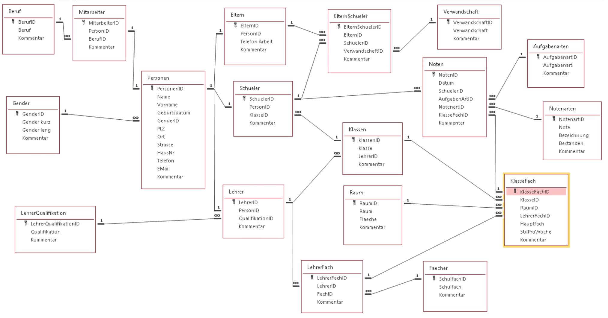

# Schulverwaltungsdatenbank | School Management Database
**Ein Microsoft Access & SQL Projekt | A Microsoft Access & SQL Project**

---

## 🇩🇪 Deutsch

### Projektbeschreibung
Dies ist eine professionelle relationale Datenbanklösung zur digitalen Verwaltung von Schulprozessen. Das System wurde nach akademischen Standards entwickelt و تمامی روابط پیچیده میان دانش‌آموزان، معلمان، نمرات و والدین را پوشش می‌دهد.

### Hauptfunktionen
- **Personen-Management:** Zentrale Speicherung aller Akteure (Personen) mit Spezialisierung in Schüler, Lehrer und Mitarbeiter.
- **Unterrichtsorganisation:** Verwaltung von Klassen, Schulfächern, Räumen und deren zeitlicher Zuweisung.
- **Leistungsbewertung:** Detaillierte Erfassung von Noten basierend auf verschiedenen Aufgabenarten (Klausuren, mündliche Prüfungen).
- **Erziehungsberechtigte:** Abbildung der Eltern-Schüler-Relationen über komplexe m:n Beziehungen.

### Datenbankmodell (ER-Diagramm)
Das Modell ist vollständig normalisiert (3NF).
- **Vorschau:**

*(Das vollständige Diagramm finden Sie unter [docs/Database_ER_Diagram.pdf](./docs/Database_ER_Diagram.pdf))*

---

## 🇺🇸 English

### Project Description
A comprehensive relational database solution designed for school administration. This project demonstrates advanced database normalization, complex SQL joins, and relational integrity.

### Key Features
- **Human Resources:** Management of teachers, technical staff, and their qualifications.
- **Academic Management:** Handling of classes, subjects, room availability, and scheduling.
- **Grading System:** Accurate tracking of student performance across different task categories.
- **Guardian Relations:** Mapping students to their legal guardians using junction tables.

### Data Model
The architecture follows strict normalization principles to ensure data integrity.
- **Detailed Model:** [Database_ER_Diagram.pdf](./docs/Database_ER_Diagram.pdf)

---

## 📂 Struktur | Structure

- **/src**: `SchoolManagementSystem.accdb` (Hauptdatenbank / Main Database)
- **/sql**: 
    - `01_Mitarbeiter_Berufsliste.sql`
    - `02_Lehrer_Fach_Qualifikation.sql`
    - `03_Klassen_Lehrer_Zuordnung.sql`
    - `04_Stundenplan_Details.sql`
    - `05_Schueler_Klassenliste.sql`
    - `06_Eltern_Schueler_Beziehung.sql`
    - `07_Notenbericht_Gesamt.sql`
- **/docs**: `System_Requirements_Specification.pdf`, `Database_ER_Diagram.pdf`
- **/images**: `diagram_preview.png`

## 🛠 Technologien | Technologies
- **DBMS:** Microsoft Access (Jet/ACE Engine)
- **Language:** SQL (Complex Inner Joins, Aliases)
- **Modeling:** Entity-Relationship Modeling (ERM)

---
**Prepared by:** Siamak Goudarzi
**Date:** February 2026
